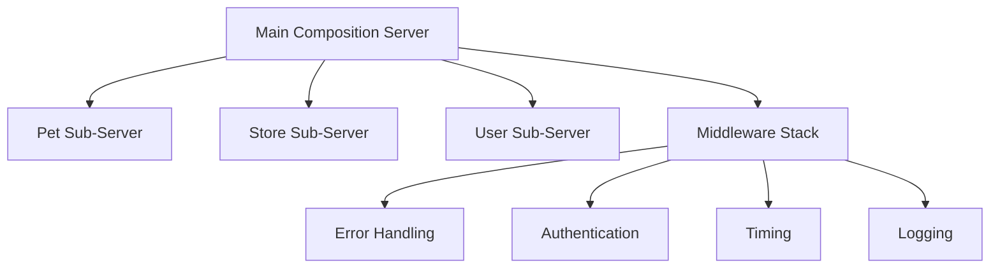

# Architecture

MCP Generator produces a **modular, composable** server architecture — not a monolithic single file.

## Generated Structure



For a Petstore API, the generator produces:

```
generated_mcp/
├── swagger_petstore_openapi_mcp_generated.py   # Main entry point
├── servers/
│   ├── pet.py              # Pet tag → sub-server (8 tools)
│   ├── store.py            # Store tag → sub-server (4 tools)
│   └── user.py             # User tag → sub-server (7 tools)
├── middleware/
│   └── authentication.py   # JWT/OAuth2 middleware
├── fastmcp.json            # FastMCP configuration
├── pyproject.toml           # Package metadata
├── Dockerfile               # Multi-stage Docker build
├── docker-compose.yml
└── README.md                # Auto-generated documentation
```

## Key Design Decisions

### One Sub-Server per Tag

Each OpenAPI tag becomes a separate FastMCP server module under `servers/`. These are composed into the main server using `mount()`:

```python
# Main composition server
app = FastMCP("Swagger Petstore")
app.mount(pet_mcp, namespace="pet")
app.mount(store_mcp, namespace="store")
app.mount(user_mcp, namespace="user")
```

This keeps each module focused and independently maintainable.

### Tag Auto-Discovery

If your OpenAPI spec has endpoints without explicit tags, the generator **automatically infers tags** from the URL path structure. For example, `/api/v1/users/{id}` gets tagged as `users`.

### FastMCP 3.x Native

The generated code targets FastMCP 3.x directly:

- `mount()` with `namespace=` (not the deprecated `import_server()`)
- `http_app()` for Streamable HTTP transport
- Built-in `EventStore` for SSE resumability
- Native middleware pipeline

### Transport Modes

The generated server supports multiple transports:

| Transport | Command | Use Case |
|---|---|---|
| **STDIO** | `--transport stdio` | Local AI clients (Claude Desktop) |
| **HTTP** | `--transport http --port 8000` | Network access, Streamable HTTP |

In HTTP mode, the server uses FastMCP's Streamable HTTP implementation with an event store for SSE resumability.

### Middleware Pipeline

Every generated server includes a configurable middleware stack:

```
Request → Error Handling → Authentication → Timing → Logging → Tool Execution
```

- **Error Handling** — catches exceptions, returns structured errors
- **Authentication** — JWT validation or backend token forwarding
- **Timing** — tracks execution duration per tool call
- **Logging** — structured request/response logging

Optional middleware (enabled via flags):

- **Caching** — response caching with configurable TTL
- **Storage** — persistent backend for tokens, sessions, cache

### MCP Resources

When `--enable-resources` is used, GET endpoints are also exposed as **MCP resources** — allowing AI clients to read API data as context without calling tools.

## OpenAPI Client

The generator includes a **pure Python OpenAPI client generator** that creates a typed API client from the spec. This client is used internally by the generated MCP tools to make HTTP requests to the backend API.

No Java or Node.js runtime is required.
