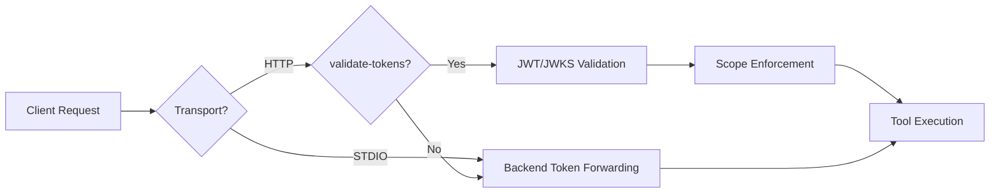

# Authentication

MCP Generator automatically generates authentication support based on your OpenAPI spec's security schemes.

## Overview



## Backend Token Forwarding (Default)

By default, the generated server forwards the `API_TOKEN` environment variable to the backend API. This is the simplest setup:

```bash
export API_TOKEN="your-api-token-here"
python server_mcp_generated.py --transport stdio
```

The token is attached to every outbound API request as a Bearer token.

## JWT Validation

When `--validate-tokens` is enabled, the server validates incoming JWT tokens at the HTTP layer:

1. **Token Extraction** — extracts JWT from `Authorization: Bearer <token>` header
2. **JWKS Discovery** — auto-discovers JWKS endpoint from OpenAPI spec or `{backend_url}/.well-known/jwks.json`
3. **Signature Verification** — validates JWT signature using the public key
4. **Claims Validation** — checks expiration, issuer, audience
5. **Scope Enforcement** — verifies required scopes per operation
6. **Identity Injection** — makes user identity available to tools

### Configuration

JWT configuration is **automatically extracted** from your OpenAPI specification during generation:

| Setting | Source | Default |
|---|---|---|
| JWKS URI | OpenAPI security scheme | `{backend_url}/.well-known/jwks.json` |
| Issuer | OpenAPI security scheme | `{backend_url}` |
| Audience | OpenAPI security scheme | `backend-api` |

### Enable at Runtime

```bash
python server_mcp_generated.py --transport http --validate-tokens
```

Or set as default in `fastmcp.json`:

```json
{
  "middleware": {
    "config": {
      "authentication": {
        "validate_tokens": true
      }
    }
  }
}
```

!!! note
    All JWT configuration is baked into the generated code — no environment variables needed.

## OAuth2 Support

When your OpenAPI spec contains OAuth2 security schemes, the generator automatically creates an OAuth2 provider.

### Supported Flows

- **Implicit** flow
- **Authorization Code** flow
- **Client Credentials** flow
- **Password** flow

### Features

- Scope extraction and validation from the OpenAPI spec
- Token introspection
- JWKS-based JWT verification
- Scope enforcement middleware

## Testing Authentication

### Generate a Test Keypair

```bash
uv run python scripts/generate_jwt_keypair.py
```

This generates an RSA keypair for local JWT testing.

### Test with MCP Inspector

```bash
# Without validation
npx @modelcontextprotocol/inspector python server_mcp_generated.py

# With token
npx @modelcontextprotocol/inspector \
  -e API_TOKEN=your-token \
  python server_mcp_generated.py
```

## MultiAuth (FastMCP 3.1)

Compose multiple token verifiers for complex authentication scenarios:

```json
{
  "features": {
    "multi_auth": {
      "enabled": true,
      "providers": [
        {"type": "jwt", "name": "internal"},
        {"type": "oauth2", "name": "third_party"}
      ]
    }
  }
}
```

Use cases:

- Accept both internal JWTs and third-party OAuth tokens
- Support multiple identity providers
- Graceful migration between auth systems

The generated `create_multi_auth_verifier()` function composes verifiers using FastMCP's `MultiAuth`:

```python
from fastmcp.server.auth import MultiAuth

verifier = create_multi_auth_verifier(config["providers"])
# Returns MultiAuth(verifiers=[jwt_verifier, oauth_verifier, ...])
```

## Dynamic Component Visibility (FastMCP 3.0)

Per-session component toggling based on user scopes/roles:

```json
{
  "features": {
    "dynamic_visibility": {
      "enabled": true
    }
  }
}
```

When enabled, the authentication middleware can show/hide tools based on the authenticated user's permissions:

```python
# In authentication middleware (on_request)
if "admin" in scopes:
    ctx.enable_components(["admin_tools"])
else:
    ctx.disable_components(["admin_tools"])
```

This allows:

- Role-based tool visibility
- Feature flags per user
- Graceful capability degradation
